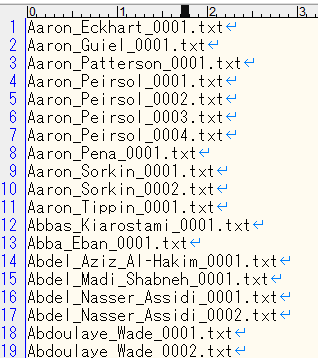

# dnn_face_recognition_ex

## requirements
**Visual Studio 2017** or higher is required to build.  

- **OpenCV-3.4.1** or higher is required
- You need **libpng.lib, libjpeg.lib**, which will be in **Anaconda3\Library\lib** if you have Anaconda3 installed.

The following libraries are not always required.  
- **[Intel Math Kernel Library](https://software.intel.com/content/www/us/en/develop/tools/math-kernel-library.html)**
- [CUDA 10.2](https://developer.nvidia.com/cuda-10.2-download-archive) is required for calculation using GPU.__
also needs [cuDNN v8.0.2 (July 24th, 2020), for CUDA 10.2](https://developer.nvidia.com/cudnn)

## start  
Place the photo of the person you want to authenticate in **images**.  

## step1  
Execute **step1_step3.bat**  
A photo list (**imagelist.txt**) to be authenticated is created.  
  

## step2  
Execute **step2.bat**  
The 128D-feature vector of each target person is generated from the photo list (imagelist.txt) to be authenticated, and the data is generated in **user_shape.**  
The face image recognized from the photo is saved in **user_images**, but it will not be used anymore.  

  

## step3  
Execute **step1_step3.bat**  
A list of feature vectors (shapelist.txt) for each subject to be authenticated is generated.  

  

## step4
Use **step4_face_recognition_cpu.bat** or **step4_face_recognition_cuda.bat** to identify the person on your webcam or USB camera.  

It recognizes the face of a person in the camera and obtains the feature vector of that face.
If the same feature vector as the feature vector matches any of the feature vectors in shaplist.txt, it is judged as a registered face.  
  