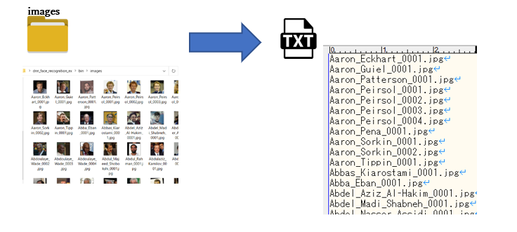
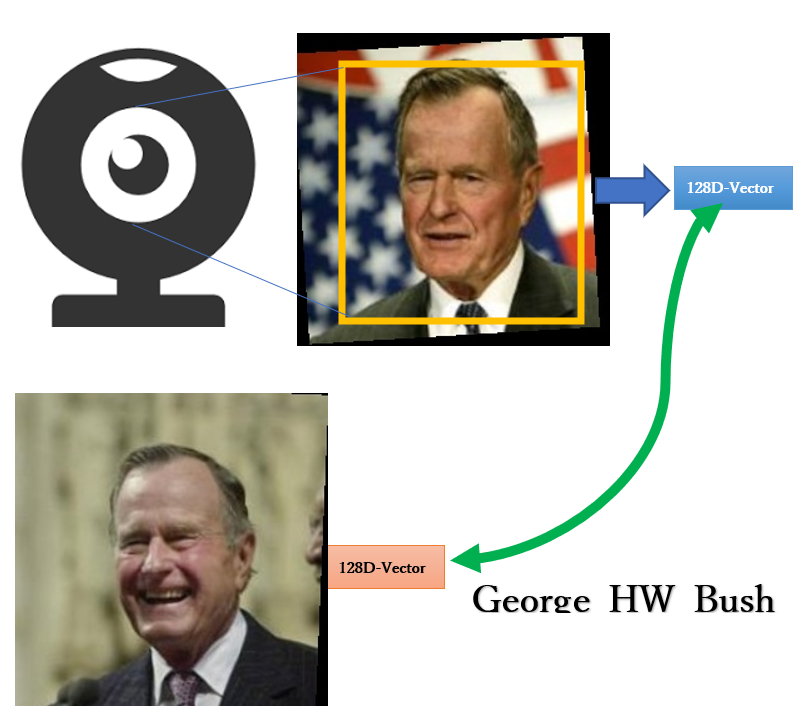

# dnn_face_recognition_ex  

### identified people correctly in almost everything..    
the threshold is 0.31.This is not a very good value.  
Bruce_Willis was mistaken for Jose_Dirceu, Jean_Charest.
  
  
  

This is an example of forcing others to be identified as the same person, but the threshold has been raised to 0.31 so it's really unidentifiable.

This program is created by referring toEverything was correct. [dnn_face_recognition_ex.cpp](http://dlib.net/dnn_face_recognition_ex.cpp.html).  
Most of the main mechanism is the same as [dnn_face_recognition_ex.cpp](http://dlib.net/dnn_face_recognition_ex.cpp.html).  
	It uses the pre-trained [dlib_face_recognition_resnet_model_v1 model](https://github.com/davisking/dlib-models).  
Quoting the comments from the original [dnn_face_recognition_ex.cpp](http://dlib.net/dnn_face_recognition_ex.cpp.html),	the accuracy of the standard LFW surface for this model is **99.38%**.  
A recognition benchmark comparable to other cutting-edge methods for the face Certified as of February 2017.  

## requirements
**Visual Studio 2017** or higher is required to build.  

- **dlib-19.21** or higher is required
- **OpenCV-3.4.1** or higher is required
- You need **libpng.lib, libjpeg.lib**, which will be in **Anaconda3\Library\lib** if you have Anaconda3 installed.

The following libraries are not always required.  
- **[Intel Math Kernel Library](https://software.intel.com/content/www/us/en/develop/tools/math-kernel-library.html)**
- [CUDA 10.2](https://developer.nvidia.com/cuda-10.2-download-archive) is required for calculation using GPU.__
also needs [cuDNN v8.0.2 (July 24th, 2020), for CUDA 10.2](https://developer.nvidia.com/cudnn)

## start  
Place the photo of the person you want to authenticate in **images**.  

  

** `face_capture_???.bat` user_name **  
You can also take the photo required to register your face.
Take a front-facing photo and save it in capture.  

## step1  
Execute **step1_step3.bat**  
A photo list (**imagelist.txt**) to be authenticated is created.  
  

## step2  
Execute **step2.bat**  
The 128D-feature vector of each target person is generated from the photo list (imagelist.txt) to be authenticated, and the data is generated in **user_shape.**  
The face image recognized from the photo is saved in **user_images**, but it will not be used anymore.  

  

## step3  
Execute **step1_step3.bat**  
A list of feature vectors (shapelist.txt) for each subject to be authenticated is generated.  

  

## step4
Use **step4_face_recognition_cpu.bat** or **step4_face_recognition_cuda.bat** to identify the person on your webcam or USB camera.  

It recognizes the face of a person in the camera and obtains the feature vector of that face.
If the same feature vector as the feature vector matches any of the feature vectors in shaplist.txt, it is judged as a registered face.  
  

# command line option
`dnn_face_recognition_ex.exe [parameter option] [command option]`
## parameter option
- **`--t value`**  
    value=Collation judgment threshold(default 0.2)
- **`--one_person [0|1]`**  
    0:no limit on the number of people to recognize
    1:recognition limited to one person
- **`--face_chek [0|1]`**  
    0: no check  1:Inspect if it is straight in front  
- **`--dnn_face_detect [0|1]`**  
    0:default  
    1:CNN based face detector  
    2:Resnet based face detector  
- **`--video moving_image_file`**  
    Input will be a video file  
    
    
## command option  
- **`--cap [username]`**  
    create face image -> ./capture
- **`--m`**  
    imagelist.txt ->(output) shapelist.txt
- **`--recog`**  
    real time camera image -> face recognition
- **`--image imagefile[.png|.jpg]`**  
    imagefile -> face recognition

    
`dnn_face_recognition_ex.exe imagefile[.png|.jpg]`  
   imagefile -> user_shape/imagefile.txt
`dnn_face_recognition_ex.exe video_file`  
   video_file -> user_shape/video_file.txt   