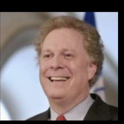
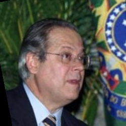
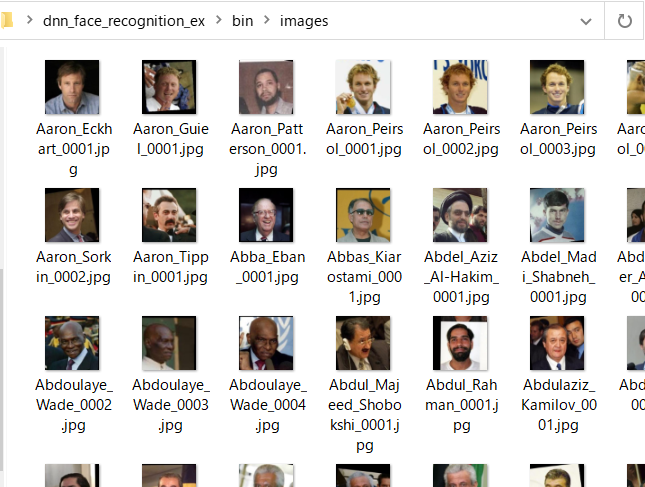
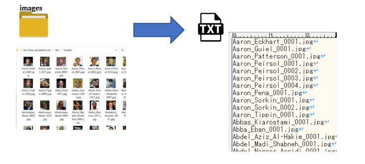
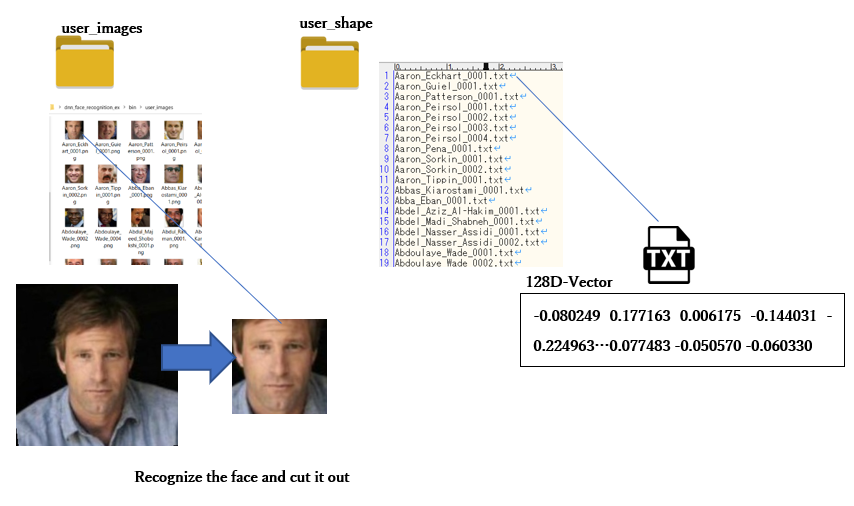
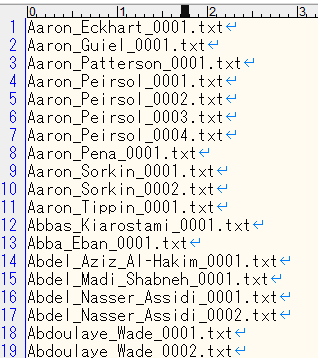
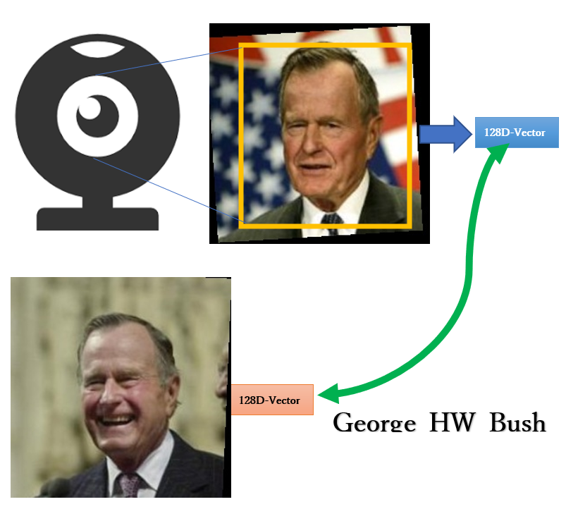

# dnn_face_recognition_ex  

### ほとんどすべての人を正しく識別しました。..    
しきい値は0.31です。これはあまり良い値ではありません。
Bruce_WillisはJose_Dirceu、Jean_Charestと間違えられました。
  
  
  

これは、他のユーザーを同じ人物として識別してしまう例ですが、しきい値が0.31に引き上げられているため、実際には識別できません。

このプログラムは、[dnn_face_recognition_ex.cpp](http://dlib.net/dnn_face_recognition_ex.cpp.html)を参照して作成されています。
主なメカニズムのほとんどは、[dnn_face_recognition_ex.cpp](http://dlib.net/dnn_face_recognition_ex.cpp.html)と同じです。
事前トレーニング済みの[dlib_face_recognition_resnet_model_v1 model](https://github.com/davisking/dlib-models)モデルを使用します。
元のdnn_face_recognition_ex.cppからのコメントを引用すると、このモデルの標準LFWサーフェスの精度は99.38％です。
2017年2月現在、顔認証の他の最先端の方法に匹敵する認識ベンチマーク。

## requirements
ビルドには**Visual Studio 2017** かそれ以上が必要です.  

- **dlib-19.21** かそれ以上が必要です.
- **OpenCV-3.4.1** かそれ以上が必要です.
- **libpng.lib, libjpeg.lib**, これは、Anaconda3がインストールされている場合、**Anaconda3\Library\lib**にあります。 　
 
次のライブラリは必ずしも必要ではありません（が推奨します）.  
- **[Intel Math Kernel Library](https://software.intel.com/content/www/us/en/develop/tools/math-kernel-library.html)**
- [CUDA 10.2](https://developer.nvidia.com/cuda-10.2-download-archive) is required for calculation using GPU.__
also needs [cuDNN v8.0.2 (July 24th, 2020), for CUDA 10.2](https://developer.nvidia.com/cudnn)

## start  
認証する人物の写真を**images**に配置します。 .  

  

** `face_capture_???.bat` user_name **  
顔の登録に必要な写真を撮ることもできます。正面の写真を撮って、キャプチャに保存します。.  

## step1  
**step1_step3.bat**を実行します。認証する写真リスト（**imagelist.txt**）が作成されます。

  

## step2  
**step2.bat**を実行します。認証対象の写真リスト（**imagelist.txt**）から対象人物の128D特徴ベクトルを生成し、**user_shape**にデータを生成します。
写真から認識された顔画像は**user_images**に保存されますが、今後は使用されません。

  

## step3  
**step1_step3.bat**を実行します。認証される各サブジェクトの特徴ベクトルのリスト（**shapelist.txt**）が生成されます。

  

## step4  
**step4_face_recognition_cpu.bat**または**step4_face_recognition_cuda.bat**は、ウェブカメラやUSBカメラで人物を識別します。カメラ内の人物の顔を認識し、その顔の特徴ベクトルを取得します。特徴ベクトルと同じ特徴ベクトルが、**shaplist.txt**内のいずれかの特徴ベクトルと一致する場合、登録顔と判断されます。  
  

## コマンドラインオプション  
dnn_face_recognition_ex.exe [パラメータ] [コマンド]  

### パラメータ  
- --t value  
 - - value=認証閾値(default 0.2)  

- --one_person [0|1]  
   - - 0:同時複数人  
   - - 1:一人のみ  

- --face_chek [0|1]  
	- - 0: 顔の向きを正面に限定しない  
	- - 1: 顔の向きを正面に限定  

- --dnn_face_detect [0|1]  
	- - 0:defaultの顔認識  
	- - 1:CNN basedの顔認識  
	- - 2:Resnet basedの顔認識  

- --video moving_image_file  
	- - 入力を動画ファイルにします。  
	
- --no_show [0|1]  
	- - 0: 画像・動画を表示する  
	- - 1: 画像・動画を表示しない 　
- `--num_gitters` value  
    - - エンコーディングを計算するときに顔を再サンプリングする回数。高いほど正確ですが、遅くなります（つまり、100は100倍遅くなります）      
 
### コマンド  
- --cap [username]  
	- - 正面顔をカメラまたは画像からキャプチャしてcaptureフォルダに１０枚生成します。  
	
- --m  
	- - shapelist.txt からuser_shapeホルダーに登録者の顔特徴ベクトルにエンコードしたファイルをリストアップ  

- --recog  
	- - カメラまたは動画ファイルから顔認証  

- --image imagefile[.png|.jpg]  
	- - 画像ファイルから顔認証  
- --vector 128dim_vector.txt  
    - - 特徴ベクトルファイルから顔認証  
    
#### コマンドラインオプションが画像ファイルだけの場合  
- user_shapeホルダーに登録者の顔特徴ベクトルにエンコードしたファイルを生成  
